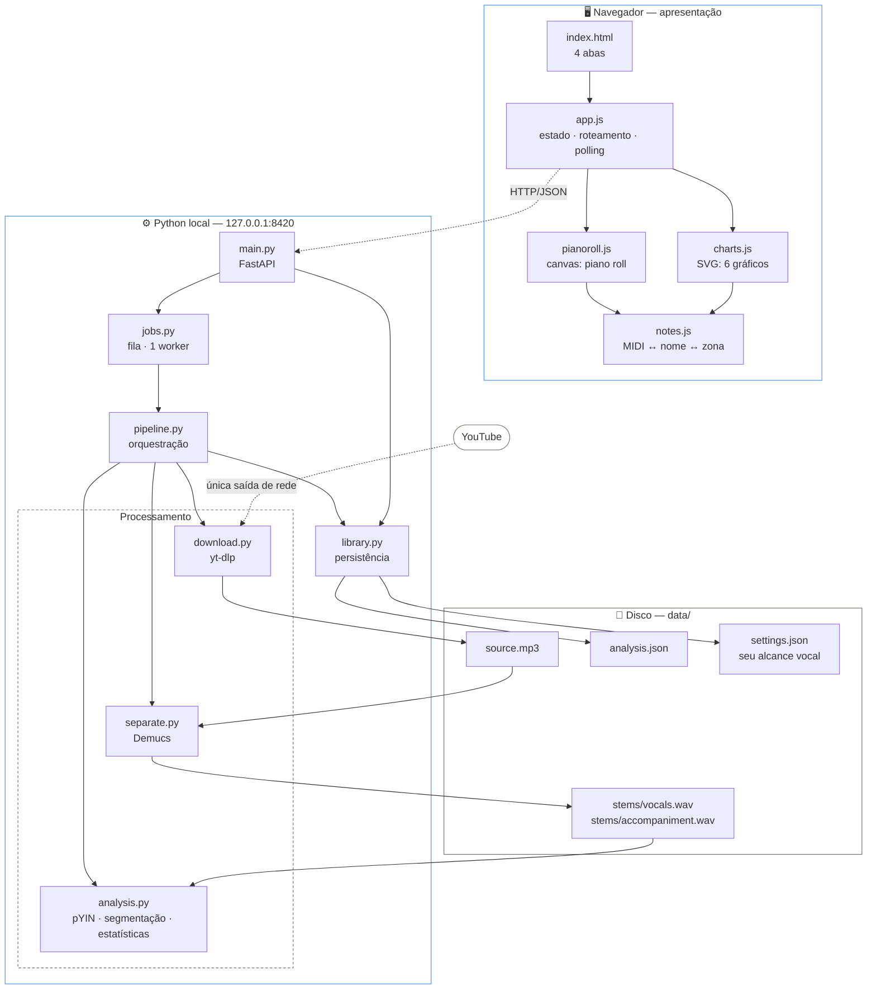
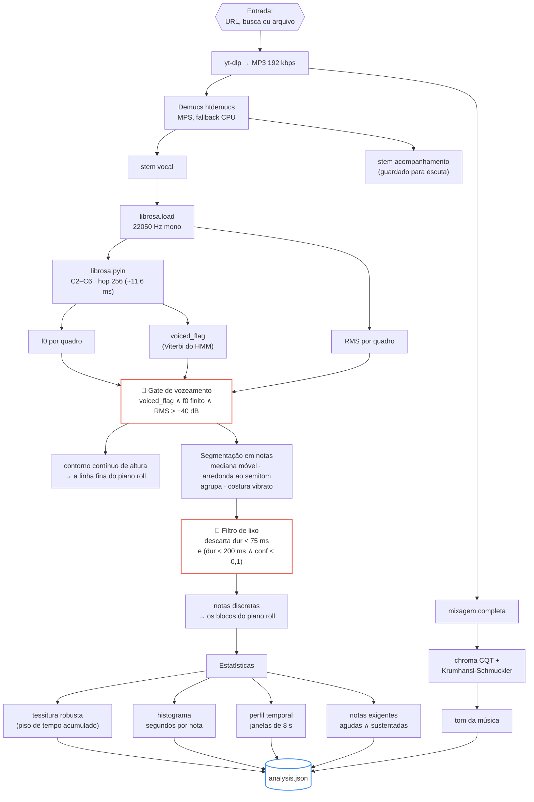
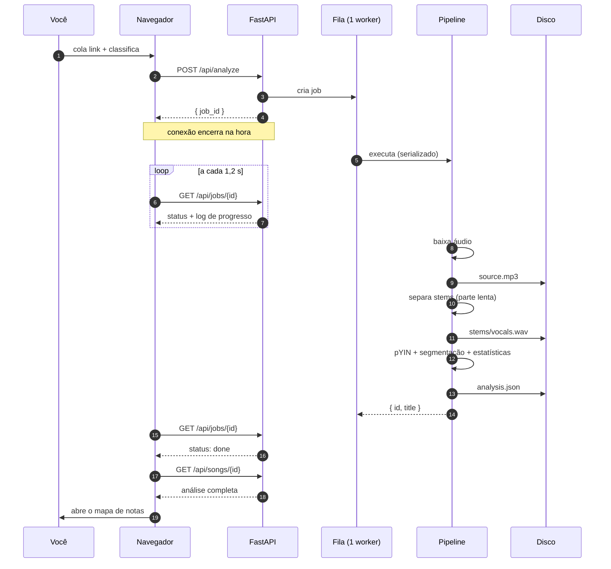
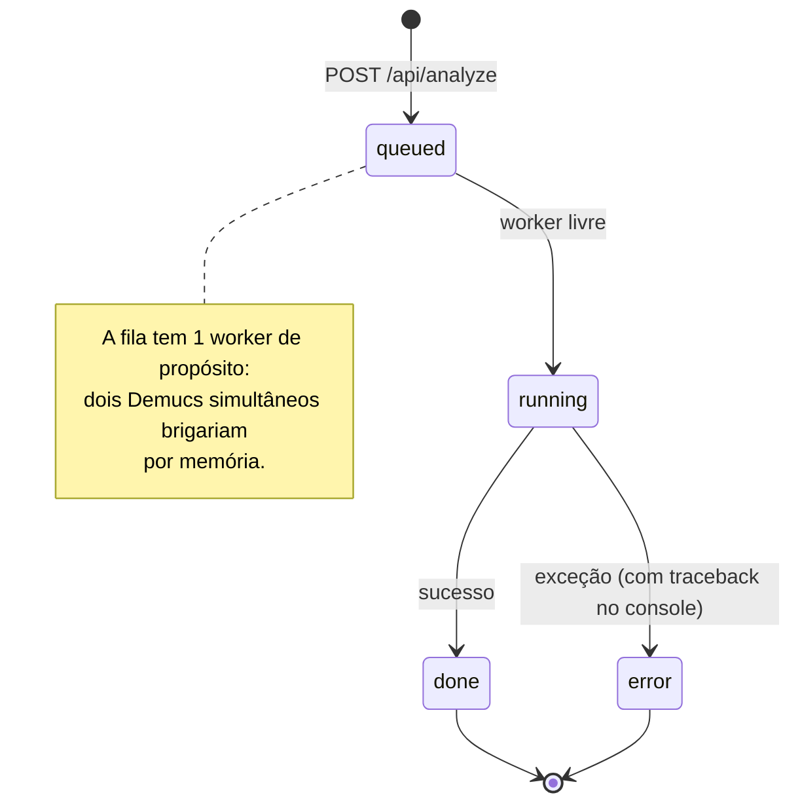
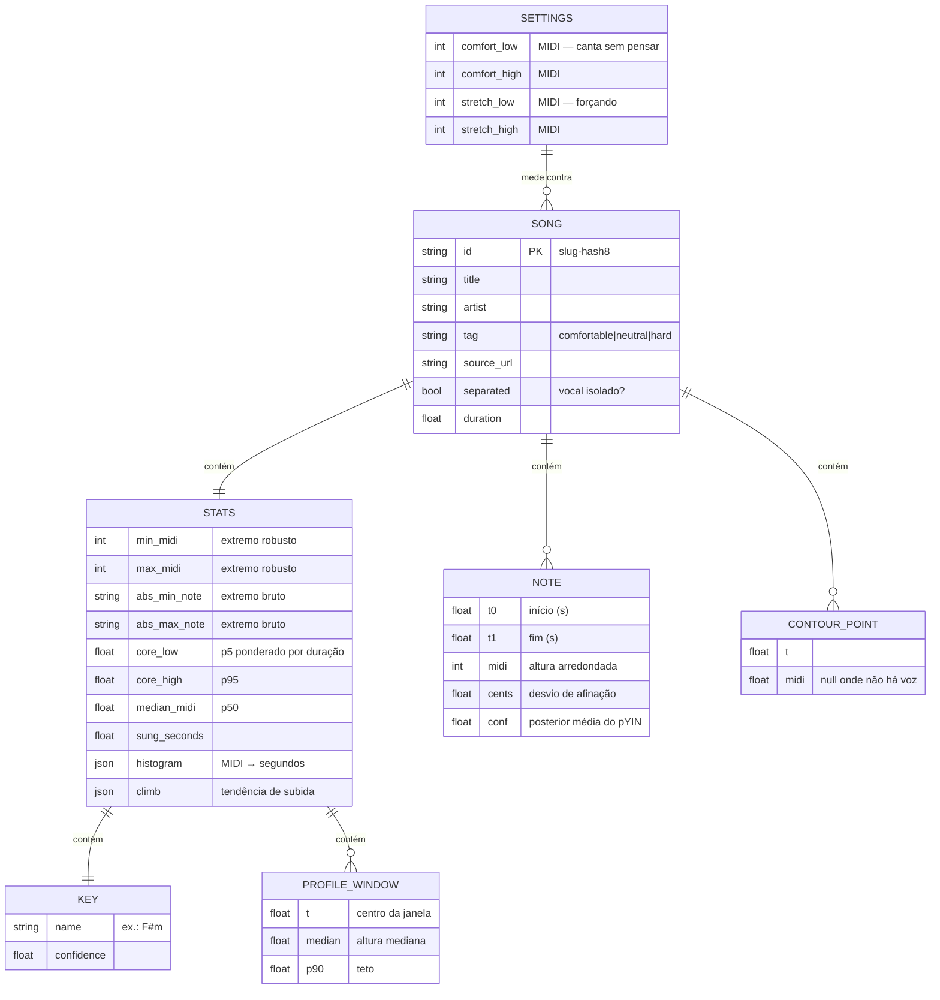

# Tessitural

Ferramenta local para descobrir **por que certas músicas são confortáveis de cantar e outras não**.

Você dá um link do YouTube (ou só o nome da música). Ela baixa o áudio, isola o vocal,
detecta cada nota cantada e mostra num mapa estilo Melodyne onde a melodia passa —
comparada com o *seu* alcance vocal.

Tudo roda na sua máquina. Nenhum áudio sai daqui.

---

## Sumário

- [Rodar](#rodar)
- [Como usar](#como-usar)
- [O que cada visualização responde](#o-que-cada-visualização-responde)
- [Arquitetura](#arquitetura)
  - [Visão geral dos componentes](#visão-geral-dos-componentes)
  - [O pipeline de análise](#o-pipeline-de-análise)
  - [Ciclo de vida de uma análise](#ciclo-de-vida-de-uma-análise)
  - [Estados de um job](#estados-de-um-job)
  - [Modelo de dados](#modelo-de-dados)
- [Decisões de projeto](#decisões-de-projeto)
- [API](#api)
- [Limitações que valem saber](#limitações-que-valem-saber)
- [Estrutura do repositório](#estrutura-do-repositório)

---

## Rodar

```bash
./run.sh
```

Abre em <http://127.0.0.1:8420>. Na primeira execução o script cria o ambiente e instala
as dependências (inclui PyTorch, ~2 GB). Variável `PORT` muda a porta.

**Requisitos:** Python 3.11+, `ffmpeg` no PATH, `uv`. Testado em macOS/Apple Silicon.

## Como usar

1. **Minha voz** — diga onde fica sua voz. Duas faixas: o *confortável*, onde você canta
   sem pensar, e a *extensão*, até onde você chega forçando. Não precisa acertar de
   primeira; depois de analisar algumas músicas a aba sugere valores a partir das que você
   marcou como confortáveis. A régua no topo da tela mostra esse alcance o tempo todo.
2. **Analisar** — cole o link ou digite o nome da música. Classifique como confortável /
   difícil / não sei. Leva alguns minutos: a separação do vocal é a parte demorada.
3. **Música** — o veredito em uma frase, o mapa de notas e os detalhes.
4. **Biblioteca** — todas as músicas na mesma régua. É aqui que o padrão aparece.

## O que cada visualização responde

| Visualização | Pergunta |
|---|---|
| **Mapa de notas** (piano roll) | Onde exatamente a melodia passa? O que estoura meu alcance, e quando? |
| **Tempo cantado por nota** | Onde a voz *mora* — não os extremos, mas o centro de gravidade |
| **Como a música sobe** | A melodia cresce ao longo do arranjo? (o padrão "Marília Mendonça") |
| **Melhor tom para você** | Se eu transpuser, quanto melhora? Qual o tom ideal? |
| **Momentos mais exigentes** | Quais agudos sustentados vão me cansar, e em que minuto |
| **Tessitura por música** (biblioteca) | As que eu acho difíceis realmente saem do meu alcance? |
| **Confortáveis × difíceis** | A média dos dois grupos, lado a lado |

---

## Arquitetura

### Visão geral dos componentes

O navegador é só a camada de apresentação. Todo o processamento pesado acontece em Python,
no seu computador — o "servidor" é uma ponte local, não um serviço remoto.



### O pipeline de análise

Do áudio bruto às estatísticas de tessitura. Os dois gates em destaque são o que separa um
resultado musicalmente honesto de uma pilha de ruído.



### Ciclo de vida de uma análise

A requisição HTTP devolve um `job_id` imediatamente — uma análise leva minutos, e segurar a
conexão aberta durante o Demucs seria frágil. A interface faz polling.



### Estados de um job



### Modelo de dados

Uma pasta por música, sem banco de dados. Apagar a pasta remove a música.



---

## Decisões de projeto

**Por que o vozeamento vem do `voiced_flag`, não da `voiced_prob`.**
O `voiced_flag` do pYIN é o caminho de Viterbi do HMM — uma decisão já suavizada no tempo.
A `voiced_prob` que acompanha é uma posterior marginal e vive baixa mesmo em canto claro:
em *Sixteen Tons* a mediana é **0,09** nos quadros que o próprio pYIN classificou como
vozeados. Filtrar por `voiced_prob > 0,5` descartava 88% do canto real (13 s detectados de
~90 s cantados). Ela só serve como piso para lixo, no nível da nota.

**Por que os extremos não são o mínimo e o máximo brutos.**
Um único quadro com erro de oitava viraria "a nota mais grave da música". Uma altura só
entra nos extremos se a voz permanece nela por um tempo mínimo somado ao longo da faixa —
1% do tempo cantado, no mínimo 0,3 s. Isso preserva o agudo sustentado que realmente exige
algo do cantor e descarta o lampejo de 100 ms. Os brutos ficam em `abs_min_note` /
`abs_max_note`.

**Por que a separação de stems não é opcional na prática.**
O pYIN rastreia qualquer conteúdo com altura definida. Medido no acompanhamento isolado de
*Sixteen Tons*: **76 s de "notas" detectadas** — o baixo e a guitarra. Analisar a mixagem
mistura isso com a voz. A opção de pular a separação existe para material já a capela.

**Por que MPS e não MLX.**
O Demucs roda em PyTorch, que já acelera na GPU do Apple Silicon via Metal (MPS), com queda
automática para CPU se algo falhar. Não há port maduro do Demucs para MLX, e o pYIN é DSP
sequencial que não se beneficiaria de GPU.

**Por que a sua voz não é uma cor.**
A interface tem três papéis visuais que nunca se misturam: a **sua voz** é uma superfície
iluminada (o chão contra o qual se mede), a **música** é tinta (azul o que está ao alcance,
coral o que estoura) e o **âmbar** é identidade — marca, aba ativa, foco — e nunca encosta
em dado. Pintar a sua faixa de âmbar foi testado e reprovado: ΔE 14,0 contra o coral,
indistinguível até com visão normal. O par azul↔coral passa em tudo (ΔE 22,9 em protanopia).
Verde × vermelho, a escolha ingênua para "confortável × difícil", falha com ΔE 4,1 em
deuteranopia. Além disso, no piano roll a posição vertical já diz se a nota cabe; a cor só
reforça. Todo gráfico tem legenda, e os principais têm visão em tabela.

**Por que uma fila com um worker só.**
Dois Demucs simultâneos brigariam por memória. A fila serializa; o tempo de espera aparece
no log de progresso.

## API

| Método | Rota | O que faz |
|---|---|---|
| `GET` | `/api/health` | Estado do servidor e se o Demucs está disponível |
| `POST` | `/api/analyze` | Enfileira uma análise. Corpo: `url` ou `file_path`, `title`, `artist`, `tag`, `separate` |
| `POST` | `/api/upload` | Recebe um arquivo do navegador, devolve `file_path` |
| `GET` | `/api/jobs` | Jobs ativos (para retomar o polling após recarregar a página) |
| `GET` | `/api/jobs/{id}` | Status e log de progresso |
| `GET` | `/api/library` | Índice enxuto de todas as músicas |
| `GET` | `/api/songs/{id}` | Análise completa (notas, contorno, estatísticas) |
| `PATCH` | `/api/songs/{id}` | Atualiza `tag`, `note`, `title`, `artist` |
| `POST` | `/api/songs/{id}/reanalyze` | Refaz só o pYIN, reaproveitando os stems do disco |
| `DELETE` | `/api/songs/{id}` | Remove a música e seus arquivos |
| `GET` | `/api/songs/{id}/audio/{mix\|vocals}` | Serve o áudio para tocar junto do piano roll |
| `GET`/`PUT` | `/api/settings` | Seu alcance vocal |

`/api/docs` tem o Swagger gerado pelo FastAPI.

## Limitações que valem saber

- **Backing vocals entram junto.** O Demucs separa *voz* de *instrumento*, não voz principal
  de coro. Em músicas com harmonias, o teto da tessitura pode ser do coro e não do cantor
  principal. Cheque no mapa de notas se o agudo extremo é uma linha isolada.
- **O tom detectado é uma estimativa** por correlação de perfis. Razoável em música tonal
  simples; modulações não são detectadas.
- **Sem separação, o resultado é lixo** — veja a medição acima.
- **A análise mede a gravação, não você.** Ela diz que altura a música exige; se você alcança
  é o que a comparação com o seu alcance responde.

## Estrutura do repositório

```
app/
  main.py       API e servidor estático
  pipeline.py   orquestração entrada → áudio → stem → análise → biblioteca
  download.py   yt-dlp (aceita URL ou busca por nome)
  separate.py   Demucs
  analysis.py   pYIN, segmentação, estatísticas, detecção de tom
  library.py    persistência (uma pasta por música)
  jobs.py       fila de background
  notes.py      conversões MIDI ↔ nome ↔ frequência
web/
  index.html    4 abas
  style.css     tokens de design, tema claro/escuro
  app.js        estado, roteamento, polling
  pianoroll.js  piano roll em canvas
  charts.js     gráficos em SVG
  notes.js      helpers compartilhados
data/           áudio, stems e análises (fora do git)
  settings.json  seu alcance vocal
  songs/<id>/    source.mp3 · stems/ · analysis.json
```
